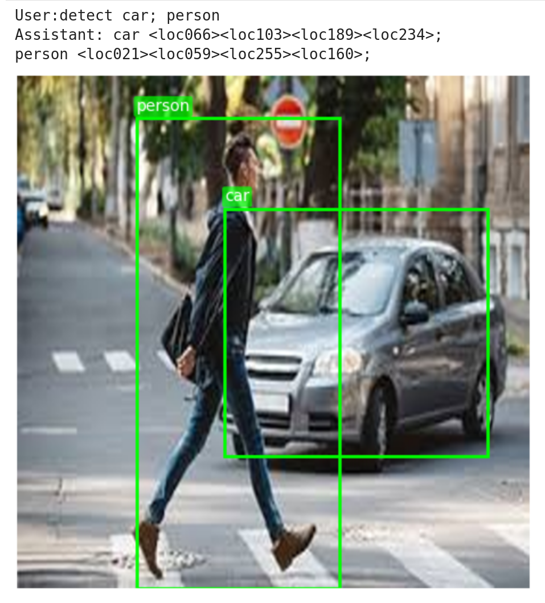

# SmolVLM for Object Detection

## UPDATES


- My understanding so far: `eval2.ipynb`
    - I trained the model once again, this time with more epochs and all available bboxes in the image
    - model is biased towards larger bboxes, doesn't bother to generate small bboxes
    - class imbalance is severe, can't recognize objects of coco with presumably less samples
    - the model still doesnt understand the concept of the <object> not being present in the image, if we ask it to detect car in a photo of people, it'll generate a random bbox so needs such `not present` samples perhaps
    - unfortunately, the VLM has lost its original capabilities -- maybe fixable if we had trained with LoRA? I am not sure.
    - is terrible at detecting multiple objects in the image, even for the new model which I trained with all bboxes.

---


- Training
    - model: [SmolVLM-256M-Instruct](https://huggingface.co/HuggingFaceTB/SmolVLM-256M-Instruct) -- its just a really good model for the size and for the GPU poors, what can I say
    - I trained it on COCO for 7 epochs took about 10hours with < 10gigs of VRAM.
    - As you know there are a LOT of bboxes in 1 COCO image so for each class I chose the bbox with the maximum area to make it easy on the model so its decent at detecting large objects.
    - There's option to enable synonyms as well which I generated for each label to make it "open vocabulary" -- didnt include in this so please update the trainer.py to get rid of that if you want to try it :)

---

- Special Tokens:
    - adding special tokens didn't work unfortunately as this is how the project had started, the model collapsed and never learnt to predict the special tokens.
    - switched from 1024 tokens to 256 tokens, still the same issue.
    - inspired by [Aritra's Gemma 3 Finetuning](https://x.com/ariG23498/status/1922606702462894531) I then switched to just normal text instead of special tokens.
    - I even considered averaging out embeddings of the special <locXXX> tokens every few steps with their nearby <locXXX> tokens to improve "generalization" but that was trash.

Here are the basic results:




Still a long way to go, but hey atleast it works :)


```
A man's heart plans his way, But the LORD directs his steps. Proverbs 16:9
```
